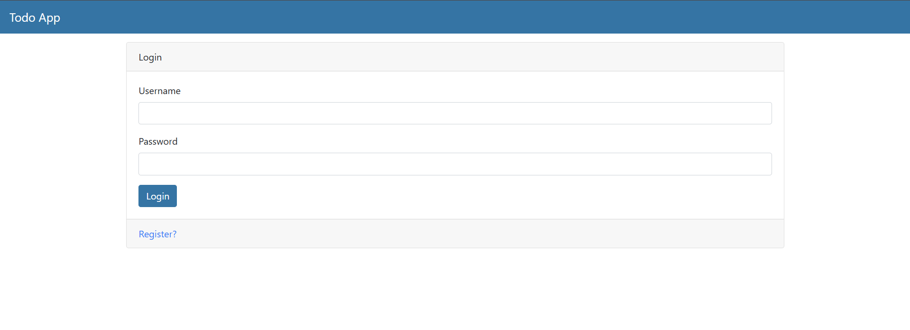
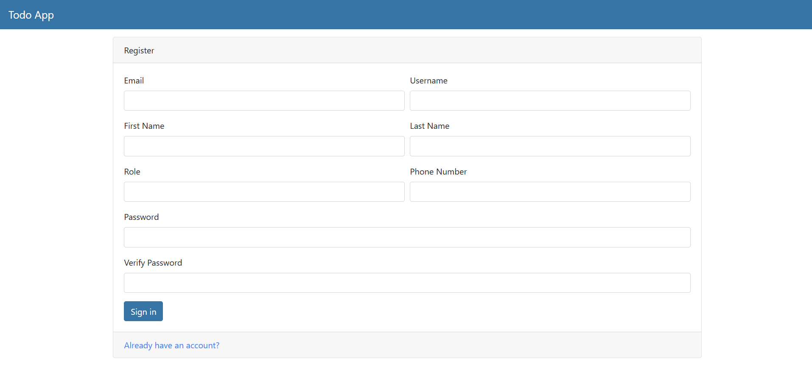
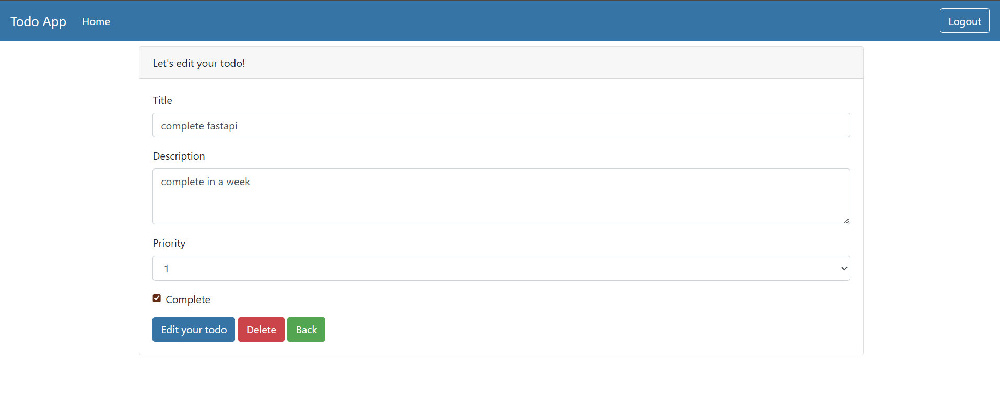
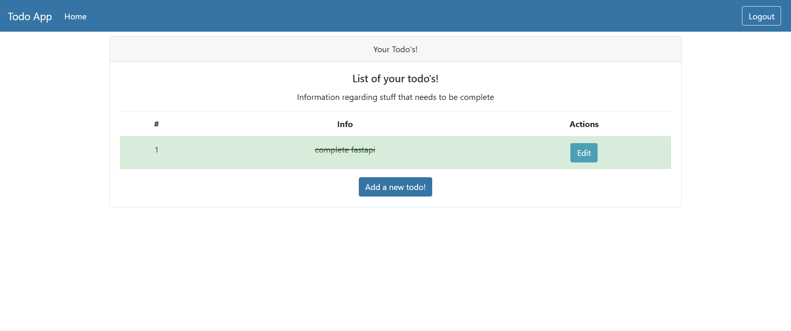

# ToDo Full Stack App 

A full-stack ToDo application that allows users to manage tasks efficiently. Built with **FastAPI** (backend), **SQLite** , **PostgreSQL** (database), and **HTML/CSS/JavaScript** (frontend). Users can register, login, and perform CRUD operations on tasks.

---

## Features

* **User Authentication**

  * Sign up, login, logout
  * Passwords securely hashed
* **Task Management**

  * Create, read, update, and delete tasks
  * Set priority and completion status
* **User-Specific Tasks**

  * Each user can only access their own tasks
* **Frontend**

  * HTML, CSS, and JavaScript interface
  * Interactive and responsive
* **Database**

  * SQLite for persistent data storage
* **RESTful API**

  * Clean endpoints for tasks and authentication

---

## Tech Stack

| Layer          | Technology            |
| -------------- | --------------------- |
| Backend        | FastAPI               |
| Database       | SQLite, PostgreSQL    |
| Frontend       | HTML, CSS, JavaScript |
| Authentication | JWT Tokens / OAuth2   |
| Deployment     | Uvicorn / Localhost   |

---

## Folder Structure

```
├── alembic/            # DB migrations
├── routers/            # API routes (auth, todos)
├── sample/             # Sample files or test data
├── static/             # CSS, JS, images
├── templates/          # HTML templates
├── test/               # Unit/Integration tests
├── venv/               # Virtual environment
├── alembic             # Alembic config
├── database.py         # DB connection
├── main.py             # FastAPI entry point
├── models.py           # DB models
├── requirements.txt    # Python dependencies
├── terminal.txt        # Notes / logs
├── testdb              # SQLite test database
├── testuser.py         # Sample user script
├── todosapp            # SQLite production database
```

---

## Installation

1. **Clone the repository**

```bash
git clone https://github.com/DwitiThaker/todo-fullstack-app.git
cd todo-fullstack-app
```

2. **Set up virtual environment**

```bash
python -m venv venv
source venv/bin/activate   # Linux/Mac
venv\Scripts\activate      # Windows
```

3. **Install dependencies**

```bash
pip install -r requirements.txt
```

4. **Run the backend**

```bash
uvicorn main:app --reload
```

5. **Open the frontend**
   Open the HTML files in the `templates` folder in a browser. CSS and JS are linked from the `static` folder.

---

## API Endpoints

| Endpoint       | Method | Description                      |
| -------------- | ------ | -------------------------------- |
| `/auth/signup` | POST   | Register a new user              |
| `/auth/login`  | POST   | Login and receive JWT token      |
| `/todos/`      | GET    | Get all todos for logged-in user |
| `/todos/`      | POST   | Create a new todo                |
| `/todos/{id}`  | PUT    | Update a todo                    |
| `/todos/{id}`  | DELETE | Delete a todo                    |

---

## Screenshots

* **Login Page**  
  

* **Dashboard / Todo List**  
  

* **Add Todo**  
  

* **Edit Todo**  
  

---

## Future Enhancements

* Categories or tags for tasks
* Notifications / reminders
* Dark mode
* Deployment with Docker and cloud hosting

---

## Contributing

1. Fork the repository
2. Create a branch (`git checkout -b feature/YourFeature`)
3. Commit your changes (`git commit -m "Add feature"`)
4. Push to branch (`git push origin feature/YourFeature`)
5. Open a Pull Request

---

## License

MIT License. See [LICENSE](LICENSE) for details.

---

## Author

**Dwiti Thaker**

* GitHub: [DwitiThaker](https://github.com/DwitiThaker)

---


## Authors

- [@DwitiThaker](https://github.com/DwitiThaker)


## Demo

Insert gif or link to demo

